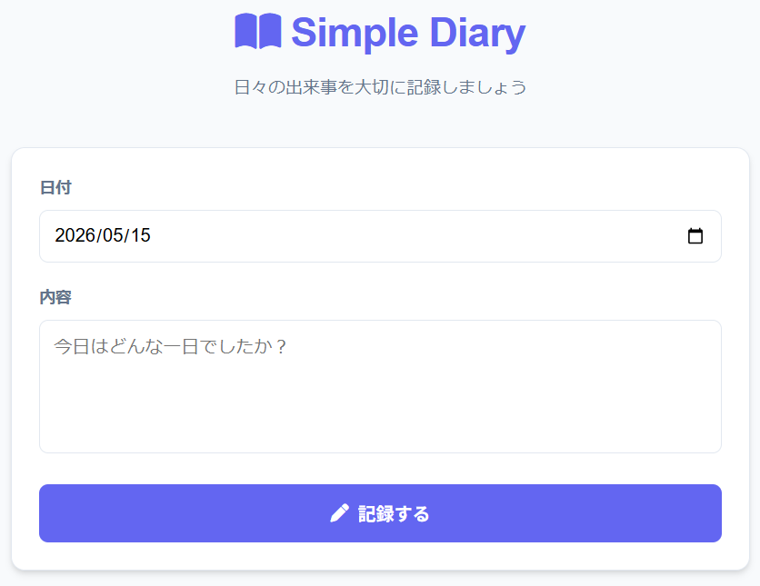

# 💖 ぷりぷりダイアリー

毎日をかわいく、楽しく、音楽とともに記録できる「ゆめかわ」な日記アプリです。

## 🚀 アプリURL
[https://zm12026-commits.github.io/my-app2026/](https://zm12026-commits.github.io/my-app2026/)

---

## ✨ ぷりぷりポイント

### 1. ぷりぷりなデザイン (Soft & Kawaii UI)
パステルカラーの「ゆめかわ」な世界観。スマートフォンでも使いやすい、丸みのある優しいデザインです。

### 2. こころのバイオリズム (気分グラフ)
直近7日間の気分の変化をグラフで視覚化。自分の心の波を優しく見守ることができます。

### 3. ハピネス・フォーチュン (占い)
日記を保存すると、今日のラッキーカラーとラッキーアイテムを教えてくれる魔法がかかります。

### 4. 癒やしのBGM機能
右上の音符ボタンで、心地よいBGMを再生。自分だけの特別なリラックスタイムを演出します。

### 5. 文字数応援メッセージ
書けば書くほど、「すごい！👏」などの応援メッセージが届きます。

---

## 📘 使い方
1.  **きろく**: 日付と気分を選んで、今日あったことを入力します。
2.  **ほぞん**: 「まほうの ほぞん」ボタンを押すと、日記が保存され、占いが表示されます。
3.  **BGM**: 右上の音符ボタンをポチッと押すと、音楽が流れ出します。
4.  **グラフ**: トップ画面で最近の気分の変化をチェック！

---

## ⚠️ 注意点
- **保存場所**: データはお使いの「ブラウザ」内に保存されます。
- **同期**: PCとスマホなど、デバイス間でのデータ共有は行われません。
- **消失**: ブラウザのキャッシュクリアなどでデータが消える場合があります。

---

## 🛠 技術スタック
- **Frontend**: HTML5, Vanilla CSS, JavaScript (ES6+)
- **Visuals**: Canvas API (Mood Chart)
- **Audio**: Web Audio API (BGM)
- **Fonts**: Kiwi Maru
- **Deployment**: GitHub Pages
